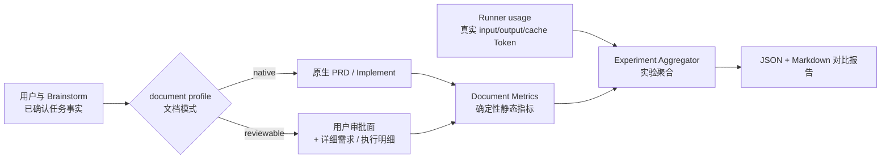

# 技术设计：可读任务文档与对照指标实验

## 设计结论

保留当前 `native` 默认链路，在 `task.py create` 增加显式 `reviewable` 选择；由同一套任务事实生成不同文档骨架。新增独立、确定性的文档度量模块和 A/B 结果聚合能力，使结构收益与真实 runner Token 分开记录。

## 边界图



## 关键不变量

- INV-1：未指定 profile 时，生成结果与当前原生模式一致。
- INV-2：最终 PRD 不包含已解决的待确认问题。
- INV-3：可审阅模式只改变信息形态，不删除需求、约束和验收。
- INV-4：estimated Token 与 actual Token 永远使用不同字段。
- INV-5：实验只改变一个主要变量；文档实验不得同时启用代码复杂度策略实验。
- INV-6：原工作树和 `data-developer` 分支的未提交内容不进入本分支。

## 文档 Profile

### native

- 复用当前 `_default_prd_content()` 字节行为。
- Task 元数据可省略或记录为 `native`，对旧 Task 向后兼容。

### reviewable

PRD 使用显式边界：

```md
<!-- trellis:approval-surface:start -->
第一屏用户审批内容
<!-- trellis:approval-surface:end -->

详细需求与验收映射
```

该标记不影响 Markdown 阅读，但让指标工具可以稳定计算审批面。若文档无标记，整个文档视为审批面，符合原生模式的真实阅读负担。

### shadow

`shadow` 是实验记录方式，不是新的 Task 生命周期。它保存同一任务事实对应的两份产物路径和展示组别，用于盲审。第一版不要求 Task 创建时自动复制完整任务目录。

## CLI 契约

计划提供以下能力，最终命名可在实现时按现有 argparse 风格落地：

```text
task.py create <title> --document-profile native|reviewable
task.py document-metrics <markdown> [--json]
task.py compare-documents <native.md> <reviewable.md> [--json]
task.py experiment-report <results.jsonl> [--format json|markdown]
```

`document-metrics` 和 `compare-documents` 是纯读取操作。`experiment-report` 只在显式给出输出路径时写报告。

## 指标 Schema

```json
{
  "task_id": "example",
  "variant": "native",
  "experiment_source": "historical_backtest",
  "assignment": "shadow",
  "base_sha": "abc123",
  "run": 1,
  "document": {
    "utf8_bytes": 0,
    "characters": 0,
    "lines": 0,
    "estimated_tokens": 0,
    "approval_surface_estimated_tokens": 0,
    "detail_estimated_tokens": 0,
    "headings": 0,
    "checklist_items": 0,
    "unresolved_placeholders": 0,
    "term_definitions": 0
  },
  "usage": {
    "input_tokens": null,
    "output_tokens": null,
    "cache_read_tokens": null,
    "cache_write_tokens": null
  },
  "interaction": {
    "approval_turns": null,
    "user_correction_tokens": null,
    "wall_clock_ms": null
  },
  "guardrails": {
    "critical_requirement_omissions": 0,
    "acceptance_passed": null
  }
}
```

## Token 估算

静态指标只用于相对比较，采用版本化、确定性的 Unicode 估算规则：

- 连续 ASCII 字母/数字按固定字符比例估算。
- CJK（中日韩统一表意文字）字符单独计入。
- 非空标点按确定性规则计入。
- 输出 `estimator_version`，保证历史结果可解释。

不引入模型专用 tokenizer 依赖。真实 input/output/cache Token 必须来自 runner usage。

## 历史回测

第一版使用仓库内固定夹具：

1. 从任务开始前可见的需求事实构建源输入。
2. 分别生成 native 和 reviewable 文档。
3. 使用指标工具输出静态对比。
4. 护栏夹具验证需求 ID 和验收 ID 没有丢失。
5. 将结果保存为版本化 JSON/Markdown。

这能证明链路、指标和内容保真，不能替代真实用户理解实验。报告必须明确该边界。

## 兼容与迁移

- 新参数默认 `native`，旧调用无需修改。
- 不修改旧 Task 文件。
- 新公共 Python 模块必须加入模板安装映射，确保 `trellis init/update` 后的目标项目也能运行。
- 中英文帮助和骨架同步；代码标识、marker 和 JSON 字段保持英文稳定。

## 风险与回滚

| 风险 | 控制 |
|---|---|
| 文档变短但丢需求 | 需求/验收 ID 保真测试和 guardrail 字段 |
| Token 估算被误认为真实 | 字段名、帮助和报告均写 `estimated` |
| 多模式导致维护漂移 | 共享数据结构，模式只负责渲染 |
| 新参数改变旧行为 | 默认原生、原生快照回归测试 |
| 实验选择偏差 | 随机样本与用户覆盖样本分组报告 |

回滚只需停止使用 `reviewable` 参数；原生链路保持可用。
