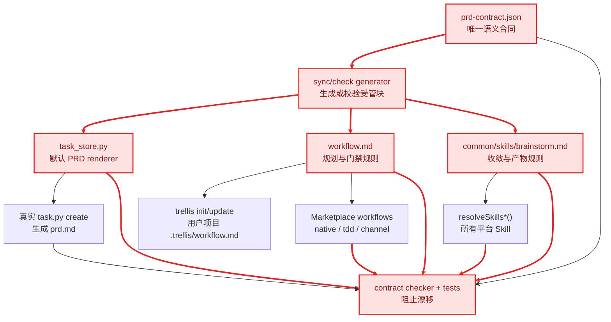
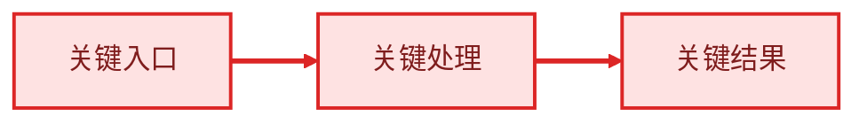

# 技术设计：统一 PRD 人读合同

## 1. 设计原则

1. 人读优先：PRD 只承载用户需要决策和验收的内容。
2. 单一语义合同：章节、顺序、边界、UI 门禁和 Mermaid 规则只定义一次。
3. 生成优于复制：可生成的产物不再手工维护平台副本。
4. 兼容优先：不改写历史 Task，不扩大 `task.py validate` 的既有职责。
5. 校验语义：测试必须证明错误结构会失败，而不是只验证文件存在或包含任意关键词。

## 2. 单一事实来源

新增 machine-readable contract（机器可读合同），建议路径：

`packages/cli/src/templates/common/prd-contract.json`

合同包含稳定 key（键）而非把整段 Markdown 作为不可解析字符串：

```json
{
  "version": 1,
  "locales": {
    "en": {
      "goal": "Goal",
      "requirements": "Requirements",
      "userVisibleOutcomes": "User-visible Outcomes"
    },
    "zh": {
      "goal": "目标",
      "requirements": "需求",
      "userVisibleOutcomes": "用户可见结果"
    }
  },
  "fixedOrder": ["goal", "requirements", "userVisibleOutcomes"],
  "goalListStyle": "ordered",
  "outcomeListStyle": "checklist",
  "optionalHumanSections": ["background", "scope", "mermaid"],
  "uiPrototypeApprovalRequired": true,
  "technicalDetailTargets": {
    "design": ["technical requirements", "algorithms", "data contracts", "compatibility", "rollout", "rollback"],
    "implement": ["ordered checklist", "commands", "test execution"],
    "research": ["source diagnosis", "file:line evidence", "investigation facts"]
  }
}
```

字段命名可在实施时按现有 TypeScript/Python 风格微调，但不得拆成三份独立常量。

## 3. 生成与传播关系



传播规则：

1. 只允许修改合同和生成器输入，受管块由 generator（生成器）刷新。
2. `common/skills/brainstorm.md` 继续作为所有平台 Brainstorm Skill 的唯一模板源。
3. 旧 `codex/skills/brainstorm` 与 `copilot/prompts/brainstorm` 在确认无活跃消费者后删除；不得把它们继续列入一致性源集合。
4. Workflow 的 Marketplace 副本是跨仓库镜像，使用相同受管标记和 checker 比较；submodule 提交必须先完成，再更新父仓库 pointer（指针）。
5. shipped Python 与 `.trellis/scripts` dogfood twin 按 filesystem-safety 规范先 `diff`，再同步相同受管块。

## 4. PRD、Design、Implement、Research 边界

| 内容 | `prd.md` | `design.md` | `implement.md` | `research/` |
| --- | --- | --- | --- | --- |
| 用户目标与价值 | 必须 | 可引用，不重复展开 | 不放 | 不放 |
| 用户/产品行为与阶段 | 必须 | 仅解释技术映射 | 仅拆执行顺序 | 可保存来源调研 |
| 用户可见结果与判断方法 | 必须 | 可映射验证机制 | 可列验证动作 | 可保存原始证据 |
| 影响用户选择的产品约束 | 并入需求或用户可见结果 | 不重复 | 不重复 | 可保存证据 |
| 技术需求、算法、数据契约 | 禁止 | 必须 | 执行时引用 | 可保存诊断 |
| 兼容、迁移、rollout/rollback | 禁止 | 必须 | 执行与回滚步骤 | 可保存版本证据 |
| 文件路径、`file:line`、源码诊断 | 禁止 | 仅必要架构引用 | 修改文件清单可用 | 主要归属 |
| 有序实现 TODO、命令、测试矩阵 | 禁止 | 不放具体执行清单 | 必须 | 可保存结果 |
| 已确认事实 | 不作固定章节，仅保留决策必要背景 | 技术事实可用 | 不放 | 完整事实与证据 |

## 5. 固定结构与可选内容

### 固定核心

1. `目标 / Goal`
   - 内容必须是 Markdown 有序列表。
2. `需求 / Requirements`
   - 只写产品行为或达成目标所需的用户可理解阶段。
3. `用户可见结果 / User-visible Outcomes`
   - 使用可核验 checklist（检查清单）。

### 可选人读辅助

- 一句话背景：只能放在核心章节之前。
- 范围说明：只能放在核心章节之后，且不能重新复制需求/结果。
- Mermaid：嵌入背景、目标或范围附近，不新增与核心概念平行的固定章节。

Checker 按 fixed section key 验证顺序，允许可选内容出现在规定位置，但不允许把 `Acceptance Criteria / 验收标准`、`Constraints / 约束`、`Confirmed Facts / 已确认事实` 重新设为固定同级核心章节。

## 6. Mermaid 红色关键链路规范

图仅在满足以下任一条件时使用：

- 三个以上组件存在传播/依赖关系；
- 关键流程有三个以上连续步骤；
- 仅靠短段落难以理解边界或顺序。

关键链路必须同时满足：



- 关键节点使用 `critical` class（类）。
- 关键边使用 `linkStyle` 红色加粗。
- 节点文字必须出现“关键”或明确业务含义，不能只靠红色区分。
- 非关键支线保持默认色，避免整图全红而失去重点。
- 没有实质理解收益时不生成图。

## 7. UI 原型审批门禁

这是 planning rule（规划规则），不新增 lifecycle 状态：

1. Brainstorm 判断 Task 涉及 UI/交互时，PRD 的“用户可见结果”必须包含原型交付和用户确认条目。
2. 最终规划摘要必须显示 prototype status（原型状态）：`pending_user_approval` 或 `approved`。
3. `pending_user_approval` 时，Skill 必须停止在 planning，不能运行 `task.py start`。
4. 用户明确确认最新原型后，才可把条目标为完成并重新提交最终规划摘要。
5. 一致性 checker 验证 Workflow 与 Brainstorm 都表达这一门禁；不尝试通过标题或文件名自动猜测任意历史 Task 是否为 UI Task。

## 8. 特殊 PRD 写入器迁移

所有新生成、文件名仍为 `prd.md` 的内容都遵循核心合同：

### Bootstrap / Joiner

- `prd.md`：改为开发者可读的目标、引导需求、用户可见结果。
- `implement.md`：承接给 Agent 的会话步骤、命令、建议开场白和 checklist。
- 不要求 `design.md`，除非该系统 Task 含技术迁移设计。
- 保持既有 task status 与创建时机，不借本次改造改变 onboarding lifecycle。

### Migration

- `prd.md`：用户为什么必须迁移、需要完成哪些用户可理解阶段、迁移完成后的可见结果。
- `design.md`：版本兼容、migration guides、风险、回滚与 breaking changes（破坏性变更）。
- `implement.md`：有序迁移命令、测试与收尾 checklist。
- 保持原 migration metadata（迁移元数据）完整，不丢失 `migrationGuide` 或 `aiInstructions`，只是移动到正确工件。

## 9. 校验设计

新增专门的 PRD contract checker，建议命令：

```bash
pnpm check:prd-contract
```

它执行四类检查：

### 9.1 Canonical projection check（事实源投影检查）

- 合同 JSON schema（模式）合法。
- Python、Workflow、Brainstorm 的受管块与 generator 输出完全一致。
- dogfood twin 的受管块与 shipped Python 一致。
- Marketplace workflow 的合同块一致。

### 9.2 Semantic rule check（语义规则检查）

从合同和规则块验证：

- 固定章节名称和顺序；
- Goal 使用 ordered list；
- User-visible Outcomes 使用 checklist；
- PRD 与 design/implement/research 内容边界；
- UI 原型确认前不得 start；
- Mermaid 使用条件与红色节点/连线规范；
- “已确认事实”不是最终固定章节。

### 9.3 Real generation check（真实生成检查）

在临时目录安装/复制 shipped templates 后真实执行：

```bash
python3 ./.trellis/scripts/task.py create "PRD contract probe" --slug prd-contract-probe --no-start
```

解析生成的 `prd.md`，验证中英文 locale（语言环境）下的核心骨架、顺序和列表类型。不得只直接调用 `_default_prd_content()`。

### 9.4 Negative mutation check（负向变异检查）

至少覆盖以下任一改动会失败：

- 调换 Requirements 与 User-visible Outcomes；
- 恢复 Acceptance Criteria 为固定章节；
- 删除“技术内容进入 design.md”的规则；
- 删除 UI prototype approval；
- 删除 Mermaid 红色 `classDef` 或 `linkStyle`；
- 平台渲染结果缺少 canonical contract block。

## 10. 为什么不修改 `task.py validate`

保留 `cmd_validate()` 当前 context manifest 职责。三层一致性是 release/source gate（发布/源码门禁），不是单个 Task 的运行时合法性。

如果未来需要对单个 PRD 做机器校验，应新增显式 `task.py validate-prd` 或 metadata version（元数据版本），并先设计历史兼容；本 Task 不通过隐式扩展 `validate` 改变所有旧 Task 的行为。

## 11. 文档与下游同步

必须同步：

- bundled `trellis-meta/references/local-architecture/task-system.md`
- bundled `trellis-spec-bootstrap/references/spec-task-planning.md`
- docs-site：
  - `guides/tasks.mdx` + `zh/guides/tasks.mdx`
  - `start/how-it-works.mdx` + `zh/start/how-it-works.mdx`
  - `start/everyday-use.mdx` + `zh/start/everyday-use.mdx`
  - `advanced/architecture.mdx` + `zh/advanced/architecture.mdx`
  - `start/real-world-scenarios.mdx` + 中文镜像中的 PRD 模板与边界示例
- `.trellis/spec/docs-site/docs/sync-on-change.md` 新增 PRD contract trigger（触发器）
- Marketplace 三份 workflow
- 新版本 changelog（变更日志）；历史 changelog 不重写

README 只描述 Plan 会产出 PRD，不声明旧章节，可在最终 grep 后决定是否需要最小更新。

## 12. 兼容与迁移

- 现有 Task：不扫描、不改写、不因旧章节失败。
- 新 Task：使用新合同。
- 用户本地模板：继续由 `.template-hashes.json` 判定 pristine（未修改）或 modified（已修改）；modified 走既有保留/覆盖/`.new` 路径。
- Locale：合同同时定义 `en` 与 `zh`，语义 key 相同；实施前合并当前目标分支已有中文化代码。
- Marketplace/docs-site：先提交各自 submodule，再更新父仓库 pointer；任何一侧失败都可独立回滚。
- 特殊系统 Task：只改变新生成工件，不迁移既有 onboarding/migration Task。

## 13. 风险与回滚

| 风险 | 防护 | 回滚点 |
| --- | --- | --- |
| 从旧 worktree 覆盖中文化/可读性改造 | 实施前 rebase/merge 并重新做影响分析 | 放弃旧基线改动，回到目标分支 |
| 生成器造成大范围非预期文本变化 | 受管 marker + `--check` + `git diff --stat` | 回滚 generator 输出提交 |
| 特殊 PRD 拆分丢失 migration guide | 内容保真测试与 fixtures | 恢复原 writer，保留合同测试失败状态 |
| 平台 Skill 漂移 | 只测 common source + 全平台 rendered outputs | 回滚平台生成改动 |
| Marketplace/docs-site 子模块不同步 | 子模块分别验证后再更新父指针 | 回滚父仓库 submodule pointer |
| 历史 Task 被新校验阻塞 | 不修改 `task.py validate` | 移除误加的 runtime gate |

## 14. 实施前门禁

- 当前 planning 已完成，不代表 implementation approval（实现批准）。
- 用户必须审批本设计摘要后，才能选择目标分支、运行 `task.py start` 并修改产品文件。
- 若实施前目标分支已继续变化，先刷新研究证据和 GitNexus impact（影响分析），再开始。
