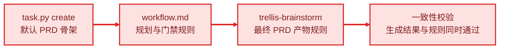

# 统一 PRD 人读结构与三层生成规则

当前默认 PRD（产品需求文档）模板、Workflow（工作流）和 `trellis-brainstorm` Skill（技能）对 PRD 内容的定义不一致，用户与 Agent（智能体）无法从同一套规则判断一份 PRD 是否已经收敛。

## 目标

1. 让用户在不同平台和任务类型中看到同一套简短、重点明确、可核验的 PRD 核心结构。
2. 让 Agent 明确区分 PRD、`design.md`、`implement.md` 与 `research/` 的内容边界，不再把技术设计和执行细节塞入 PRD。
3. 建立可自动执行的三层一致性校验，使模板、Workflow、Skill、平台产物和文档后续不能静默漂移。

## 需求

- PRD 的固定核心章节为“目标”“需求”“用户可见结果”，并保持该顺序；目标使用 `1、2、3……` 有序列出。
- “需求”只记录用户或产品行为，以及为了达成目标需要完成的产品阶段；技术需求、解析算法、数据契约、兼容方案、执行步骤和源码证据不进入 PRD。
- “用户可见结果”统一承接原有“约束”“验收标准”“用户可见结果”中的用户视角内容，用可核验条目说明完成后用户能看到什么、如何判断结果符合预期。
- 影响用户选择或结果的产品约束并入“需求”或“用户可见结果”；纯技术约束进入 `design.md`。
- “已确认事实”只作为 Brainstorm（需求探索）的临时分类，不成为默认 PRD 固定章节；仅保留影响用户决策的一句话背景或必要范围说明。
- PRD 可在确实提升理解时加入一句话背景、范围说明或 Mermaid 图；图中的重要链路必须以红色节点和红色连线标记，并同时使用文字标签，不能只依赖颜色表达。
- UI（用户界面）类 Task 必须把原型纳入“用户可见结果”，且只有用户明确确认原型后，规划门禁才能允许进入开发。
- 默认 PRD 生成模板、Workflow 规则、`trellis-brainstorm` Skill 及其平台生成结果必须来自同一语义合同，并由自动校验阻止章节、顺序、边界或门禁漂移。
- 所有实际生成 `prd.md` 的路径都要被盘点；默认任务、bootstrap（首次引导）、joiner（新成员引导）和 migration（迁移）任务不得在新合同下继续产生未经声明的平行 PRD 语义。
- 现有 Task 不做批量改写；升级时保护用户已修改的模板和任务文件。

## 用户可见结果

- [x] 用户运行真实 `task.py create` 后，新 PRD 的核心骨架只包含按顺序排列的“目标”“需求”“用户可见结果”，且目标默认使用有序列表。
- [x] 用户阅读 Workflow、任一平台生成的 `trellis-brainstorm` Skill 和文档站说明时，看到的固定章节、内容边界、UI 原型审批门禁及 Mermaid 关键链路规则一致。
- [x] 用户可以从 PRD 直接理解“为什么做、需要哪些产品行为、完成后能看到什么”，技术设计、执行清单和源码证据分别位于 `design.md`、`implement.md`、`research/`。
- [x] UI 类 Task 的最终规划摘要会明确显示原型及用户确认状态；未确认时不能进入 `task.py start`。
- [x] 自动校验不仅检查文件存在，还会在章节缺失或乱序、旧“验收标准”重新成为固定章节、技术边界规则缺失、UI 门禁缺失、Mermaid 红色规范缺失或真实生成骨架不符时失败。
- [x] 英文与中文输出遵循同一语义合同；旧 Task 保持原样，用户修改过的本地模板仍由既有 hash（哈希）冲突机制保护。
- [x] 规划审批前仅产出本 Task 的 `prd.md`、`design.md`、`implement.md`、`research/` 与 context manifest（上下文清单），lifecycle（生命周期）保持 `planning`。

## 范围说明

- 本 Task 包含合同定义、默认与特殊 PRD 写入路径、Workflow、Brainstorm Skill、多平台传播、Marketplace（市场）工作流镜像、文档、校验与测试。
- 本 Task 不改写历史 Task，不引入新的 Task lifecycle 状态，不在规划审批前修改产品源码、运行 `task.py start`、提交或推送。
