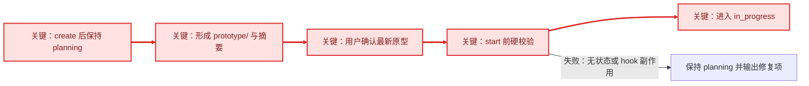

# 设计：UI 原型目录与启动硬门禁

## 1. 设计原则

1. `prototype/` 是 UI Task 的一等规划产物，与 `research/` 同级，不是临时附件。
2. UI 识别必须显式、机器可读；CLI 不从标题或 PRD 文本推断。
3. 批准必须绑定具体原型内容，不能只保存一个永久有效的 `approved` 字符串。
4. start 门禁失败必须无副作用；状态、活动指针和 lifecycle hook 都不能先行变化。
5. 新能力仅作用于显式启用的 UI Task，避免升级后阻塞历史仓库。

## 2. 标准 Task 目录

```text
.trellis/tasks/<task>/
├── task.json
├── prd.md
├── design.md
├── implement.md
├── implement.jsonl
├── check.jsonl
├── research/
└── prototype/
    ├── manifest.json
    ├── index.html        # 推荐主入口；manifest 允许声明其他文件
    ├── preview.png       # 供无法直接运行原型时快速查看
    └── assets/           # 仅在存在独立资源时创建
```

主入口和预览必须位于当前 Task 的 `prototype/` 内。路径解析后越出该目录、符号链接指向目录外或引用绝对路径时，门禁失败。

## 3. 机器可读合同

### `task.json.meta`

使用既有扩展字段，不新增顶层 Task Schema：

```json
{
  "meta": {
    "ui": "true",
    "prototype_manifest": "prototype/manifest.json"
  }
}
```

- `ui == "true"` 时启用硬门禁。
- `prototype_manifest` 必须是当前 Task 内的相对路径，并解析到 `prototype/manifest.json`。
- 未设置 `ui=true` 的旧 Task 不自动进入门禁。

### `prototype/manifest.json`

建议 version 1 合同：

```json
{
  "version": 1,
  "entry": "prototype/index.html",
  "preview": "prototype/preview.png",
  "artifact_digest": "sha256:...",
  "status": "pending_user_approval",
  "approved_digest": null,
  "approval_evidence": null
}
```

- `artifact_digest` 由主入口、预览和 manifest 声明的资源内容生成；manifest 自身的批准字段不参与摘要，避免循环依赖。
- 用户明确确认后，`status` 改为 `approved`，`approved_digest` 写入当时的 `artifact_digest`，并记录非空 `approval_evidence`。
- start 时重新计算当前摘要。只有 `status=approved`、`artifact_digest=approved_digest=当前摘要` 且批准依据非空时才可放行。
- 原型文件发生变化会自然造成摘要不一致，从而要求重新确认。

## 4. 生命周期门禁



在 `cmd_start` 完成 Task 路径解析并读取 `task.json` 后，立即调用独立 validator（校验器）。validator 必须先于以下动作：

1. `set_active_task()`；
2. `status: planning → in_progress`；
3. `run_task_hooks("after_start", ...)`。

validator 返回结构化错误集合，CLI 将其转为稳定、可翻译的用户提示。正常模式和 degraded mode 共用同一校验入口，避免分支漂移。

## 5. 规划阶段行为

- `trellis-brainstorm` 识别到 UI/交互范围后，必须把 Task 标记为 `ui=true`，建立 `prototype/manifest.json`，并把原型交付与用户确认写入用户可见结果。
- 原型未形成时保持 `pending_user_approval`，不得制造批准依据。
- 用户确认必须发生在原型可查看之后；原型实质变化后，规划摘要重新回到待确认状态。
- 可增加窄范围的 CLI helper（辅助命令）来计算摘要和记录批准，但不通过扩大 Task status 集合解决问题。

## 6. 兼容性

- 非 UI Task：完全跳过新 gate，维持现有行为。
- 历史 UI Task：只有显式写入 `meta.ui=true` 后才启用，不做标题或文件扫描。
- `task.py validate`：继续只校验 `implement.jsonl` / `check.jsonl`，避免改变已发布命令语义；prototype validator 由 `start` 直接复用，并可由专用命令单独调用。
- 生命周期状态：仍为 `planning → in_progress → completed`，prototype status 是附属合同，不新增 Task status。
- Template/dogfood：`packages/cli/src/templates/...` 是发布源，`.trellis/...` 是 dogfood 镜像，两者必须同步。

## 7. 传播范围

实施时至少审计并按职责更新：

- `packages/cli/src/templates/trellis/scripts/task.py` 及 `.trellis/scripts/task.py`；
- 新增或复用 `packages/cli/src/templates/trellis/scripts/common/` 下的 prototype validator，并同步 dogfood；
- `packages/cli/src/templates/common/prd-contract.json` 与 `packages/cli/scripts/check-prd-contract.mjs`；
- 英文/中文 Workflow、`trellis-brainstorm`、`trellis-continue`、bundled `trellis-meta` Task System 说明；
- `packages/cli/test/regression.test.ts`、PRD contract tests、Task meta tests 及必要的 i18n strings；
- `docs-site` / Marketplace 只在父仓库自身实现确实要求同步时更新；其外部 PR 不作为 `cooker-code/Trellis` 合并门禁。

## 8. 风险与回滚

- 风险：批准摘要算法不稳定导致无意义的重复确认。措施：固定 canonical（规范化）排序和路径编码，并用跨平台测试锁定。
- 风险：路径穿越或符号链接绕过目录边界。措施：对解析后的真实路径做 Task/prototype 根目录 containment（包含关系）检查。
- 风险：旧 Task 被误阻塞。措施：仅 `meta.ui=true` 启用，并增加非 UI/历史兼容回归。
- 风险：先触发 hook 再发现失败。措施：校验函数位于 `cmd_start` 所有副作用之前，并以 hook spy 测试。
- 回滚：移除 start 中的新 validator 调用即可恢复旧生命周期；新增 metadata 和 `prototype/` 产物保持向后兼容，不需要破坏性迁移。
