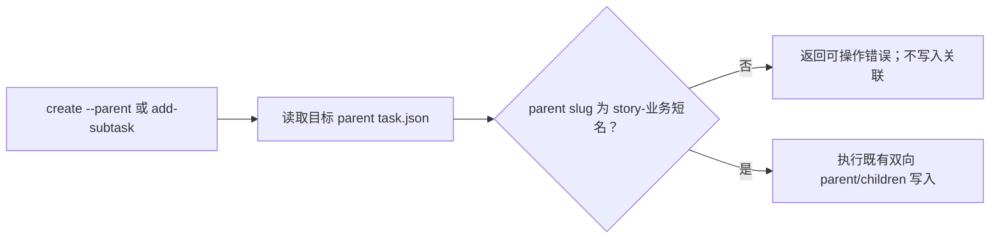

# 技术设计

## 边界与规则

- 父 task 的识别仍由 `task.json.parent` / `children` 决定；`story-` 仅是未来父 task 的强制 slug 前缀。
- `story-` 后必须有业务短名。`story-` 本身、普通 task slug、以及历史非 `story-` 父 task 均不满足新的关联入口校验。
- 只在两类写入发生前校验：`task.py create --parent` 和 `task.py add-subtask`。`list`、`archive`、`remove-subtask` 及历史数据读取不触发迁移或阻断。

## 写入路径

- 在 `create --parent` 中，将父 task 的存在与 slug 校验前置到创建新 task 目录和写入 `task.json` 之前；校验失败时命令失败，不遗留未关联的新 task。
- 在 `add-subtask` 中，保留现有的父/child JSON 存在性和 child 已有关联检查；在任何 JSON 写回前校验父 task 的 slug。
- 使用一个私有校验辅助函数，两个入口共享同一 `story-<业务短名>` 规则与错误信息，避免规则漂移。

## 兼容性与回滚

- 已存在的非 `story-` 父子树不修改、不迁移，`list` 和归档进度按当前逻辑继续工作。
- 任何新建或重新关联到非 `story-` 父 task 的操作被拒绝；用户需新建 `story-<业务短名>` 父 task 后再关联。
- 若需要回滚，只移除写入前校验与对应文档/测试；既有 `task.json` 数据无需还原。
