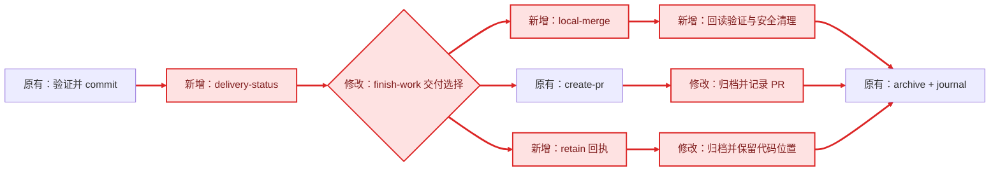

# 增加 Task worktree 交付生命周期

## 目标

1. 让 Trellis Task（任务）在 worktree（工作树）中完成开发后，能够可靠回答代码是否未提交、位于哪个 feature branch（功能分支）、是否进入 base branch（基线分支）以及下一步是什么。
2. 把交付检查、用户选择、受控集成、明确保留和资源清理纳入 `/trellis:finish-work`，但保持底层 `task.py finish` 仅清除 active Task（活动任务）指针的既有语义。
3. 防止 Task 已归档、Session（会话）已结束，但代码仍只存在于未知 worktree 或未集成 branch 中；无论是否授权合并，都必须生成可审计的交付回执。

## 需求

### R1 新增

只读交付检查：

- **R1.1** 新增 `task.py delivery-status [task] [--json]`，从 Task 已有 `branch`、`base_branch`、`worktree_path`、`commit`、`pr_url` 与当前本地 Git 事实计算交付状态。
- **R1.2** JSON 输出使用版本化合同 `trellis-git-delivery.v1`，至少包含 Task、feature/base branch、worktree 是否存在和是否干净、feature tip、相对 base 的可达性、冲突预检、远端/PR 已知状态、证据来源与安全下一步。
- **R1.3** 状态枚举为 `no_code_change | uncommitted | committed | integration_pending | integration_blocked | integrated | cleanup_pending | retained | unavailable`；只读检查不得执行 fetch、merge、Push（推送）、删除或清理。

### R2 修改

`/trellis:finish-work` 编排：

- **R2.1** 在 archive（归档）前运行 `delivery-status`；存在当前 Task 未提交改动时停止收尾，并显示精确 worktree、feature branch 和返回 Phase 3.4 的下一步。
- **R2.2** feature 已提交但未进入 base 时，只询问一次交付方式：本地受控合并、创建 PR/MR（合并请求）或明确保留；默认不合并、不 Push、不删除。
- **R2.3** 已集成时继续检查 worktree/branch 清理状态；已明确保留时允许归档，但回执必须保留 branch、commit、worktree 和保留原因。
- **R2.4** `task.py finish` 保持只清除当前 Session 指针且不改变 Task status（状态）；不得把 Git 合并副作用塞入该底层命令。

### R3 新增

受控交付操作：

- **R3.1** 新增独立 `task.py deliver <task> --mode local-merge|pr|retain`；每次执行写操作前必须有本轮用户明确授权，命令本身不得把历史配置当作本轮授权。
- **R3.2** `local-merge` 必须验证来源/目标 branch、worktree 清洁度、Task commit 可达性、目标工作区状态和冲突预检；任一条件不满足即停止，并保持可恢复现场。
- **R3.3** 默认不执行 Push；`pr` 复用现有 `create-pr` 边界并保持 dry-run（试运行）/认证失败降级；`retain` 不修改 Git，只生成明确保留回执。
- **R3.4** 合并成功后回读 base 对 feature tip 的祖先关系；不能只依据命令退出码宣称交付完成。

### R4 新增

安全清理：

- **R4.1** worktree 清理与 branch 删除是两个独立动作；只有工作区干净且提交可由 base 或明确保留 branch 到达时，才允许移除额外 worktree。
- **R4.2** feature branch 只有在确认已集成并得到删除授权后才可删除；`retain` 模式必须保留 branch。
- **R4.3** submodule（子模块）、prunable（可清理登记）、detached HEAD（游离 HEAD）、脏目标工作区、同 branch 被其他 worktree 检出和并行 Session 冲突必须显式降级或阻塞，禁止强制清理兜底。

### R5 修改

生成模板与兼容：

- **R5.1** 同步 Trellis CLI（命令行界面）源码模板、dogfood（自用）`.trellis` 与所有平台的 `finish-work` 入口，增加漂移测试；`mindfold-ai/marketplace` 不属于本 Task 的提交范围，也不作为父仓库交付门禁。
- **R5.2** 历史 Task 缺少 branch/worktree 字段或非 Git/无代码 Task 时保持可归档，输出 `unavailable` 或 `no_code_change`，不得破坏既有项目。
- **R5.3** 保留 `after_finish` 与 `after_archive` hook（钩子）的现有触发语义；交付失败不得误触发完成类 hook。

### R6 新增

验证与交付回执：

- **R6.1** 自动化测试覆盖未提交、已提交待集成、可快进、历史分叉、冲突、已集成待清理、明确保留、非 Git、缺失字段和并行 worktree。
- **R6.2** `/trellis:finish-work` 最终固定输出：代码位置、feature commit、目标 branch、集成状态、远端/PR 状态、worktree/branch 清理状态和未完成下一步。
- **R6.3** 交付回执可被 `codex-live-panel` 作为结构化消费者使用，但不得包含凭证、remote URL、完整 Git 输出或不必要的用户文件内容。

## 用户可见结果

- [x] **O1（R1.1、R1.2、R1.3）** 用户能用一个只读命令获得版本化交付状态，并看清代码当前在哪里。
- [x] **O2（R2.1、R6.2）** worktree 有未提交改动时，`/trellis:finish-work` 停止归档并给出精确恢复入口，不再把代码留在未知目录。
- [x] **O3（R2.2、R3.1、R3.3）** 已提交未集成时，用户只需在 merge、PR/MR、保留三种方式中选择一次；默认不会发生 Git 写操作。
- [x] **O4（R3.2、R3.4）** 本地合并只在安全前置条件满足且本轮获得授权后执行，并以祖先关系回读证明成功。
- [x] **O5（R4.1、R4.2、R4.3）** worktree 和 branch 分别清理；异常、并行或脏状态不会被强制删除。
- [x] **O6（R2.3、R5.2）** 用户选择保留时仍可归档 Task，但回执明确记录 feature、commit、worktree 和下一步。
- [x] **O7（R2.4、R5.3）** `task.py finish`、生命周期 hook 和历史无代码 Task 保持兼容。
- [x] **O8（R5.1、R6.1、R6.3）** 所有生成入口语义一致，测试覆盖关键风险，系统消费者可安全读取同一合同。

### 交互变化

