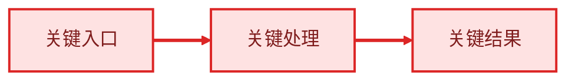

# Trellis 需求探索

## 不可协商的规划契约

要求构建、实现、修复、重构或“继续”的请求，不代表允许离开规划阶段。同意创建 Task 也不代表批准实现。

对于每个非简单 Task，在实现开始前，用户必须在初始请求后至少回复一次。如果不需要澄清，该回复必须批准下文所述的最终规划摘要。

只要仍有任何由用户决定的产品、范围、用户体验、兼容性、风险或验收决策未解决，就以唯一一个价值最高的问题结束本轮。不要编辑产品代码、派发实现工作或运行 `task.py start`。

## 不可协商的证据规则

如果某个问题可以通过探索代码库回答，就先探索代码库。

这是强制要求。询问用户前，先检查答案是否已存在于代码、测试、配置、文档、现有 Spec 或 Task 历史中。

不要让用户确认仓库已经能够回答的事实。只询问在检查后仍然不明确的产品意图、偏好、范围、风险承受度、验收行为或决策。

仓库证据能够确定当前行为和技术约束。用户期望的行为、功能范围边界和用户体验偏好永远不能只由仓库证据决定，即使已有现成模式；现有模式只是选项和推荐依据，不是决策。

---

在 Phase 1 规划中使用此 Skill，将用户请求转化为清晰需求和规划产物。

## 前置条件

仅在用户已同意创建 Task、并准备进入 Trellis 规划后使用此 Skill。

如果 Task 尚不存在，创建一个：

```bash
TASK_DIR=$({{PYTHON_CMD}} ./.trellis/scripts/task.py create "<short task title>" --slug <slug>)
```

根据用户请求使用简洁的 title。slug 不要包含日期前缀；`task.py create` 会自动添加 `MM-DD-` 目录前缀。

`task.py create` 会创建默认 `prd.md`。在提出后续问题前，先用当前理解更新该文件。

## 规划流程

1. 将用户请求和初始已知事实记录到 `prd.md`。
2. 提问前检查可用证据：
   - 代码、测试、测试夹具和配置
   - README 文件、文档、现有 Spec 和领域说明
   - 相关 Trellis Task、调研文件和 Session 历史（如存在）
3. 将发现分为：
   - 已确认事实
   - 仍需用户提供的产品意图
   - 仍需用户决定的范围或风险
   - 可能超出范围的项目
4. 如果仍有用户决定的事项，提出价值最高的一个问题，给出推荐和权衡，然后停止。不要在同一轮执行实现工作。
5. 每次用户回答后，先更新 `prd.md`，重新计算决策清单，再从第 2 步重复。
6. 没有用户决定的事项后，为复杂 Task 创建或更新 `design.md` 和 `implement.md`。
7. 运行需求收敛门禁，再执行 PRD 收敛整理。
8. 展示最终规划摘要并停止。不要在同一轮运行 `task.py start` 或编辑产品代码。
9. 只有用户后续消息明确批准最新规划摘要，才授权运行 `task.py start` 并进入实现。如果批准后产物发生实质变化，需要重新进行最终审查。

不要臆造项目专属的产品/Spec 层级。如果仓库已有产品、领域或 Spec 文档，就使用它们；如果没有，就基于已有证据继续。

## 提问规则

每条消息只问一个问题。

每个问题必须包含：

- 需要做出的决策
- 为什么答案重要
- 你的推荐答案
- 如果用户选择其他方案，需要承担的权衡

不要询问是否搜索、检查文件或继续需求探索等流程问题。直接完成证据工作。只有剩余问题属于产品决策、偏好、范围边界或风险承受度时，才询问用户。

推荐不等于默认选择。不要仅仅因为用户要求实现，就替用户选择推荐的产品决策。

当请求和仓库证据已经解决所有决策时，不要制造澄清问题。此时直接进入最终规划摘要，但仍然需要用户随后明确批准。

最终审查是必须通过的阶段转换门禁，不属于被禁止的流程问题。创建 Task 的同意、初始实现请求以及在最新最终摘要之前给出的批准，都不能满足此门禁。

## 思考框架：第一性原理分析

当需求模糊、方案显得过度设计，或准备因为“大家都这样做”而增加复杂度时，先分解为基本事实，再逐层推导。

### 第 1 步：重述问题

去除实现细节，用一句话描述问题。

> 反例：“我们需要为用户资料接口添加分布式缓存”
> 正例：“用户资料数据加载太慢”

### 第 2 步：列出基本事实

哪些内容绝对成立，而不是观点或惯例？

| 类别 | 示例 |
|----------|----------|
| **物理约束** | 网络延迟 ≥ 0，磁盘 I/O 有上限 |
| **业务规则** | “用户必须看到自己的数据” |
| **技术不变量** | “数据必须一致” |
| **用户需求** | “用户希望在 Y 秒内获得 X” |

### 第 3 步：质疑假设

针对当前计划的每个组成部分：

- **事实还是惯例？** “我们总是使用某种接口风格”——为什么？
- **如果移除会怎样？** 如果什么都不会出问题，它就是不必要的。
- **解决实际问题还是症状？** 追踪因果链。
- **谁从这种复杂度中受益？** 如果答案是“没人”，就简化。

### 第 4 步：从事实向上构建

1. 从满足所有事实的最小可行机制开始
2. 只有具体事实要求时才增加复杂度
3. 每项新增内容都必须回答：“是哪条事实要求它？”

### 第 5 步：验证

- 方案是否解决了原始问题？
- 哪些假设需要验证？
- 验证它的最简单实验是什么？

## 需求收敛门禁

最终审查前，验证以下各项：

- 用户结果和产品价值明确
- 范围内与范围外行为明确
- 验收标准描述可观察结果
- 由用户决定的产品、范围、用户体验、兼容性和风险事项均已解决
- 阻塞性待确认问题为空
- 技术未知项已调研，或已明确延后且不会改变最小可行产品行为

轻量 Task 可以省略 `design.md` 和 `implement.md`；但不能跳过证据检查、需求收敛、最终审查或新的实现批准。

最终规划摘要必须展示目标、需求、用户可见结果、关键决策、相关风险或延期事项和产物状态。用户界面 Task 还必须展示 `prototype status: pending_user_approval` 或 `approved`；最新原型未经用户明确确认前，不得运行 `task.py start`。

## 产物规则

`prd.md` 是面向人阅读的产品合同，固定核心章节必须按以下顺序出现：

- `Goal`（目标）— 使用有序列表描述用户结果和价值
- `Requirements`（需求）— 描述用户/产品行为和用户可理解的产品阶段
- `User-visible Outcomes`（用户可见结果）— 使用可核验检查清单说明用户能看到什么以及如何判断成功

背景、范围或流程图仅在确实提升理解时使用。已确认事实只是临时探索分类，不能成为最终 PRD 章节。技术设计进入 `design.md`；有序执行和验证命令进入 `implement.md`；源码诊断和 `file:line` 证据进入 `research/`。

复杂 Task 的 `design.md` 记录技术设计：

- 架构和边界
- 数据流和契约
- 兼容性和迁移说明
- 重要权衡
- 运维或回滚考量

复杂 Task 的 `implement.md` 记录执行计划：

- 有序实现清单
- 验证命令
- 风险文件或回滚点
- 运行 `task.py start` 前的后续检查

轻量 Task 可以只有 `prd.md`。复杂 Task 必须在 `task.py start` 前具备 `prd.md`、`design.md` 和 `implement.md`。

`implement.md` 不能替代 `implement.jsonl`。在派发 Sub-agent 的 workflow 中，`implement.jsonl` 和 `check.jsonl` 必须各自在 `task.py start` 前包含至少一条真实的 Spec/调研记录；种子 `_example` 行不计入。内联 workflow 跳过此 JSONL 门禁，因为 Phase 2 通过 `trellis-before-dev` 加载上下文。

## PRD 收敛整理

在宣布规划就绪或运行 `task.py start` 前，按照上文产物规则描述的最终结构重写一次 `prd.md`。这不是可选清理，而是最终规划门禁。

整理过程必须无损：

- 将重复事实合并为一个权威章节。
- 将 `What I already know`、`Assumptions` 和已解决的 `Open Questions` 等临时需求探索章节，折叠到目标、背景、需求或用户可见结果中；技术说明移入 `design.md`，证据移入 `research/`。
- 删除已解决的待确认问题，不要保留空章节或已有答案的章节。
- 当并列的缺陷清单和需求清单描述相同工作时，将其合并；保留每个缺陷的严重程度、证据和 file:line 锚点，并归入对应需求。
- 保留每项决策、用户约束、需求标识符和结果映射；将 file:line 锚点移入 `research/`。

## 流程图关键路径

仅当图确实能提升理解时才使用流程图。关键路径必须使用 `critical` 类、红色 `linkStyle` 和明确节点文字，不能只依赖颜色表达。


- 仍有任何阻塞性待确认问题时，不得进入最终审查。

整理完成后，从头到尾阅读 `prd.md`，确认没有跨章节重复的事实，除非重复确实增加了新信息。

## 文档复杂度护栏

最终审查前，对每份规划产物应用以下最小过滤器：

1. 用户是否需要依靠该内容做决定？
2. 能否用表、关键图或不变量更清楚地表达？
3. 仅供 Agent 执行的细节是否应下沉到 `implement.md`？
4. 仅作审计的证据是否应放入 `research/`？
5. 删除后若不影响决策、执行或验收，是否应删除？

不得使用这套过滤器删除用户明确要求、安全边界、兼容性要求、验收标准或完成验证所必需的证据。对于 `reviewable`（可审阅）文档模式，应将一句话结果、范围、已确认决策、不可破坏规则和成功标准放在审批面标记内，并从最终 PRD 删除已解决问题。

## 质量标准

在宣布规划已就绪前：

- `prd.md` 包含可测试的验收标准。
- `prd.md` 已通过 PRD 收敛整理：不存在未解决的临时需求探索章节、跨章节重复事实，也没有丢失锚点、决策或验收映射。
- 可由仓库回答的问题已经通过检查得到答案。
- 阻塞性待确认问题为空。
- 复杂 Task 已有 `design.md` 和 `implement.md`。
- 派发 Sub-agent 的 Task 在 `implement.jsonl` 和 `check.jsonl` 中都有真实的已整理记录；只有种子记录不算就绪。
- 最新最终规划摘要已展示给用户。
- 用户在后续消息中明确批准该摘要进入实现。

不要仅仅因为用户最初要求实现，就开始实现。

<!-- prd-contract:START -->
## PRD 合同

最终 `prd.md` 的固定章节依次为 目标（`Goal`）、需求（`Requirements`）和 用户可见结果（`User-visible Outcomes`）。目标使用有序列表，用户可见结果使用检查清单。技术设计进入 `design.md`；有序执行进入 `implement.md`；源码诊断进入 `research/`。

用户界面工作必须在用户可见结果中包含原型，并在用户明确确认前报告 `prototype status: pending_user_approval`；待确认时不得运行 `task.py start`。

仅当流程图确实提升理解时才使用。 关键路径必须有明确标签、`classDef critical`、`class ... critical` 和红色 `linkStyle`（`stroke:#dc2626`）；不能只依赖颜色。


<!-- prd-contract:END -->
